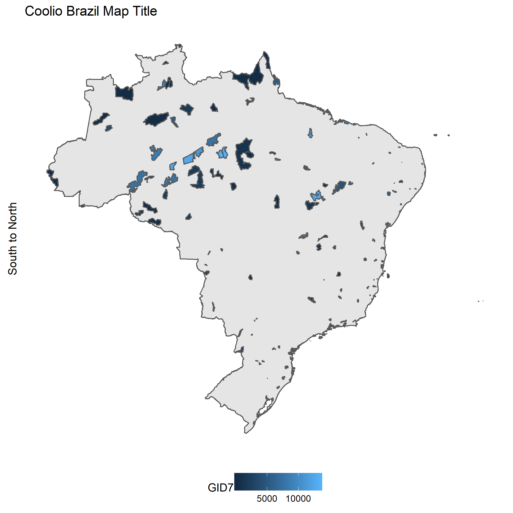

README
================
John Little
2018-02-21

Exploring
---------

1.  projection & Visualization
2.  intersection of existing polygons.
3.  calculate area of polygons

Contents of Answer
------------------

1.  [Quick solutions to Visualizing and Asigning Projection](03_solution_A_concise.Rmd)
2.  [Area & Intersect](04_area_intersect.Rmd)
3.  [ggplot reference/study](05_ggplot.Rmd)

    ggplot() +
      geom_sf(aes(), data = brazil0) +
      geom_sf(aes(fill = GID7, colors = GID7), data = ucsfi) +
      theme(legend.position = "bottom", 
            panel.background = element_rect(fill = "transparent"), 
            panel.grid.major = element_line(color = "transparent"), 
            axis.text.x = element_blank(), 
            axis.text.y = element_blank(), 
            axis.ticks = element_blank()) + 
      ggtitle("Coolio Brazil Map Title") + 
      ylab("South to North")
